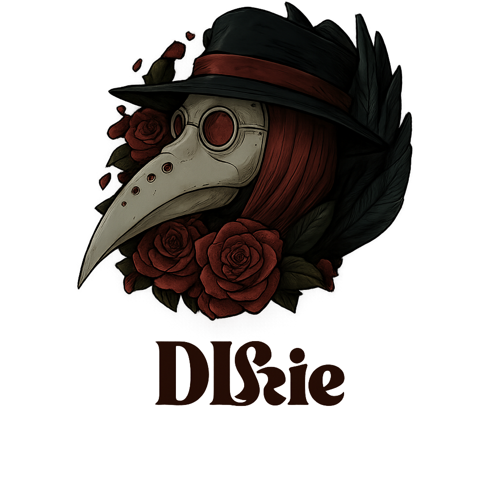
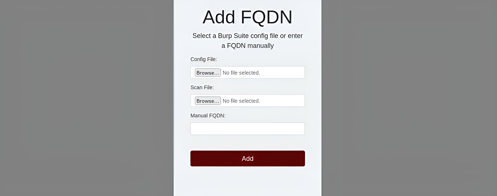
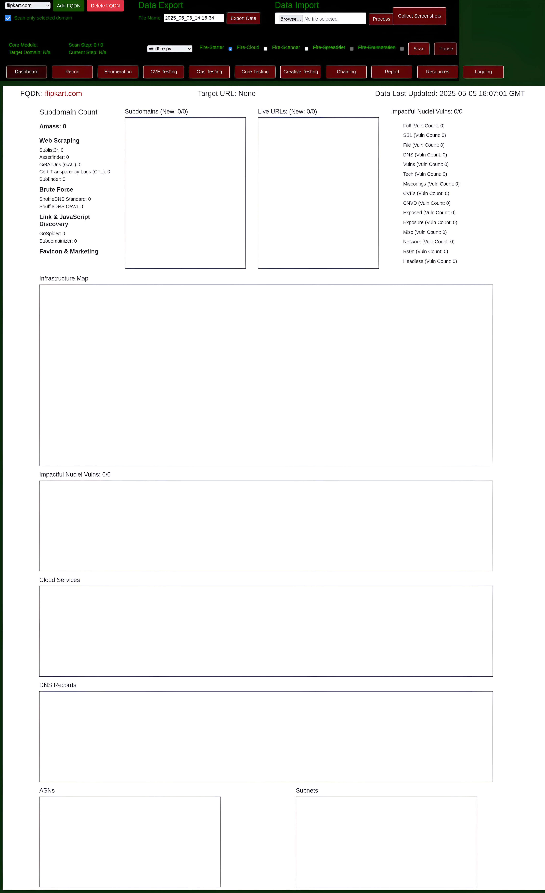
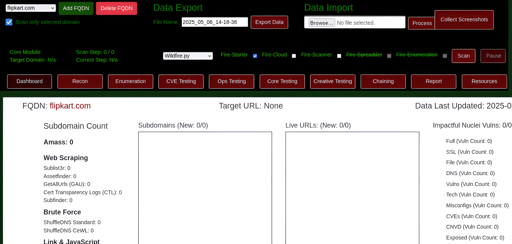
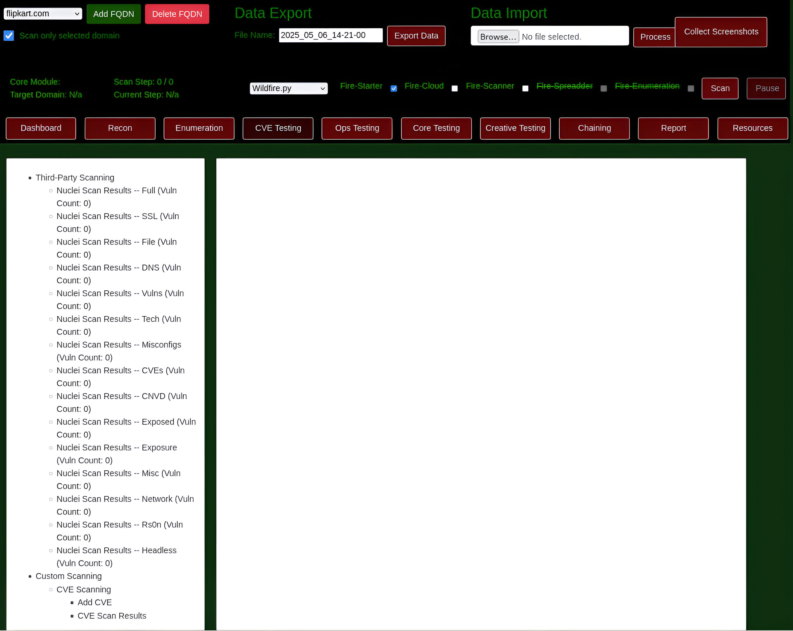
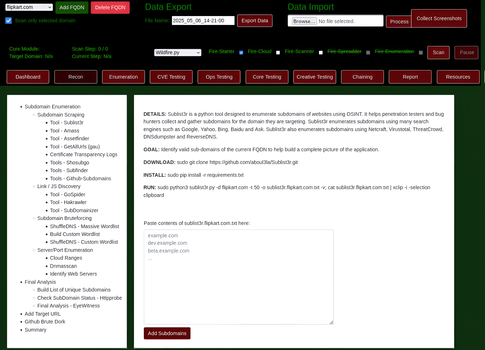

<h1 align="center">
   
  The D1lie Framework
   
  

  
  

</h1>

Howdy! I am paimon (D1lie) when I want to feel cooler than I
really am. The code in this repository started as a small collection
of scripts to help automate many of the common Bug Bounty hunting
processes I found myself repeating. Over time, I built a simple web
application with a MongoDB connection to manage my findings and
identify valuable data points. After 5 years of Bug Bounty hunting,
both part-time and full-time, I'm finally ready to package this
collection of tools into a proper framework.

 **The D1lie Framework** is designed to provide aspiring Application Security Engineers with
all the tools they need to leverage Bug Bounty hunting as a means to
learn valuable, real-world AppSec concepts and make 💰 doing it! My
goal is to lower the barrier of entry for Bug Bounty hunting by
providing easy-to-use automation tools in combination with
educational content and how-to guides for a wide range of Web-based
and Cloud-based vulnerabilities. In combination with my YouTube
content, this framework will help aspiring Application Security
Engineers to quickly and easily understand real-world security
concepts that directly translate to a high paying career in Cyber
Security. 

In addition to using this tool for Bug Bounty Hunting,
aspiring engineers can also use this Github Repository as a canvas to
practice collaborating with other developers! This tool was inspired
by Metasploit and designed to be modular in a similar way. Each
Script (Ex: `wildfire.py` or `slowburn.py`) is basically an algorithm
that runs the Modules (Ex: `fire-starter.py` or `fire-scanner.py`) in
a specific patter for a desired result. Because of this design, the
community is free to build new Scripts to solve a specific use-case
or Modules to expand the results of these Scripts. By learning the
code in this framework and using Github to contribute your own code,
aspiring engineers will continue to learn real-world skills that can
be applied on the first day of a Security Engineer I position. My
hope is that this modular framework will act as a canvas to help
share what I've learned over my career to the next generation of
Security Engineers! Trust me, we need all the help we can get!! 

</body>
</html>